# **Travely by Team High5**

**Team:** Ang Zi Chen, Chong Wen Kai, Len Chun Hoe, Ng Yit Kai

**Problem Statement:** Travel Planner (Lifestyle Track: Planning an Escape)

**Video Presentation:** https://youtu.be/4sySMv9PnOY

**Live Prototype:** https://travely.zichenangmarco.workers.dev/

---

## **1. Project Overview**

### **The Problem**

Planning a group trip is not really a logistics problem. It is a **negotiation problem that nobody wants to have out loud.**

The visible pain is well known: flights, stays, budgets and activities get scattered across five apps and a group chat, and one delayed flight collapses the whole plan. But underneath that sits the part no existing app touches — **the constraints people are embarrassed to say in front of the group.**

**Root causes we identified:**

| Cause | What it looks like in practice |
| :---- | :---- |
| **Fragmented tooling** | Bookings on Agoda, itinerary in Notes, budget in a Google Sheet, decisions in WhatsApp. Nothing talks to anything. |
| **Silent constraints** | The friend on a RM100/day budget will not type "I can't afford the omakase" into a group chat with 7 people. He just says "up to you guys." |
| **Invisible dietary & faith needs** | In a Malaysian group, halal, vegetarian, nut allergy and no-pork can all sit at the same table. Somebody ends up eating nothing, or somebody ends up being "the difficult one." |
| **Decision deadlock** | 200 messages, 8 restaurant links, nobody commits. The loudest or the most senior person decides by default. |
| **Zero replan capability** | When a flight is delayed or a place is closed, the group starts the whole negotiation from scratch. |

**Stakeholders:**

- **Primary:** university students & young working adults (18–30) travelling in groups of 3–8 in Southeast Asia — mixed-faith, mixed-diet, mixed-income friend groups.
- **Secondary:** the group organiser, who absorbs all the coordination labour and the blame when something goes wrong.
- **Tertiary:** solo travellers who want to join a group but need real safety guarantees before doing so; merchants and tour hosts who currently lose bookings to group indecision.

**Existing solutions and why they fall short:**

| Existing app | What it does well | Where it breaks |
| :---- | :---- | :---- |
| **Wanderlog** | Collaborative itinerary + map, budget tracking | Everything is public to the group. Preferences are not modelled at all — it assumes the group already agreed. |
| **TripIt** | Parses booking confirmations into one itinerary | Purely a post-booking organiser. No planning, no group decision-making, no replan. |
| **Splitwise** | Expense splitting | Solves one slice only, and after the fact. Says nothing about whether the person could afford it in the first place. |
| **Klook / Traveloka** | Booking + local pricing in SEA | Transactional. Optimised to sell you one activity, not to keep a 6-person group aligned across a week. |
| **WhatsApp + Google Sheets** *(the real incumbent)* | Free, everyone already has it | Zero structure, zero privacy, zero memory. Decisions get buried; constraints get broadcast or stay hidden. |

**The gap:** every tool on the market assumes the group has already agreed. None of them help the group *reach* agreement — and none of them let a person set a limit without confessing it.

### **Our Solution**

**Travely is a group travel planner with a private constraint layer.** Each traveller privately sets what they can and cannot do — halal only, nut allergy, a personal RM-per-meal cap, "feeling unwell today" — and Travely keeps that input confidential forever. When the group needs to decide anything, Travely silently intersects everyone's hidden constraints and shows the group only the options that already work for all of them, reporting just *"3 options were filtered out"* with no names attached to any of them. AI generates the itinerary, the group votes inside structured trip channels, and expenses split automatically — so a trip gets planned in one place without anyone having to expose their budget, their faith or their health.

**Feature set:**

1. **Anonymous Consensus Engine** — private constraints (diet, allergy, faith, personal budget cap, temporary health status) are intersected server-side. The group sees safe options and an anonymous filtered count only.
2. **AI Trip Planner** — destination, dates, party size, budget band and travel style in → hotels, flights and a day-by-day route out, pre-filtered through the group's combined constraints.
3. **Trip Workspace with channels** — `#general` `#food` `#activities` `#transport` `#expenses` `#casual`, so decisions stop getting buried in one scrolling chat.
4. **Decide tab** — vote on constraint-cleared options, see the current leader, and **Lock Decision**, which posts the outcome back into the relevant channel.
5. **Group Nudge override** — a member can re-include a filtered option for the group to consider, still without revealing whose restriction caused the filter.
6. **Receipt split** — snap a bill in `#expenses`, per-head share is recalculated instantly.
7. **Instant polls** — settle a question in-channel without a 40-message argument.
8. **Verified Global Tours** — discover and join open group tours, filtered by language, diet/faith, culture and gender group (e.g. women-only), with identity verification required to join.
9. **AI travel assistant** — an always-available bot for visas, packing and destination questions.
10. **Itinerary editor** — reorder, remove or add stops; AI suggestions drop straight into the right day.

---

## **2. Ideation & Process**

### **2.1 Ideas We Considered**

| Idea | Why it was dropped / kept |
| :---- | :---- |
| **A. Private Constraint Layer / Anonymous Consensus Engine (Chosen — became the core)** | **Kept.** Started as a small "dietary tag" feature. We realised the real friction in our own group trips was never logistics, it was the friend who stays quiet because they can't afford it or can't eat it. No competitor models this. Promoted from side feature to the spine of the product. |
| **B. Verified Global Tours with comfort filters (Chosen)** | **Kept.** Answers the "solo traveller" half of the brief and gives the product a growth loop beyond your existing friend group. Comfort filters (language, halal, women-only) reuse the exact same preference schema as Idea A, so it costs us very little extra to build. |
| **C. Structured trip workspace: channels + polls + receipt split (Chosen)** | **Kept.** This is where the constraint engine actually gets used. Without a place for the group to talk and decide, the privacy layer has nothing to plug into. Also the cheapest way to replace the WhatsApp group chat we're competing with. |
| **D. Pure AI itinerary generator** | **Dropped as a standalone product.** Every team in this track will build this, and ChatGPT already does it for free. Kept only as an input feature feeding the constraint engine, not as our differentiator. |
| **E. Flight price drop tracker / deal alerts** | **Dropped.** Requires paid flight APIs with real historical data, and it solves a booking problem rather than a group-alignment problem. Wrong problem, wrong cost. |
| **F. Travel journal / social feed (post-trip photo sharing)** | **Dropped.** Nice-to-have, no pain. It would have eaten build time and blurred the pitch. Media sharing survives inside trip chat only. |
| **G. Live re-plan on flight delay (auto-rebuild itinerary)** | **Deferred to v2.** Genuinely valuable and named in the brief, but needs live flight status + booking APIs we can't reliably demo on free tier. We scoped it down to manual itinerary reordering for the hackathon. |
| **H. Local guide / host marketplace** | **Dropped.** Two-sided marketplace with payments, KYC and supply acquisition. Impossible in hackathon scope, and it turns us into Klook. |

**The two pivots that actually changed the product:**

**Pivot 1 — from product to feature.** We started where everyone starts: an AI travel planner. We dropped it as the headline once we admitted that ChatGPT already generates itineraries for free and does it well. AI generation survived, but demoted to an input into something else.

**Pivot 2 — from coordination to confession.** While building the group workspace we kept hitting the same thing when we mapped our own trips: the blocker was never that the group lacked a place to talk. It was that some people never said what they needed. That reframing is what turned a decent group-chat-with-itineraries into Travely.

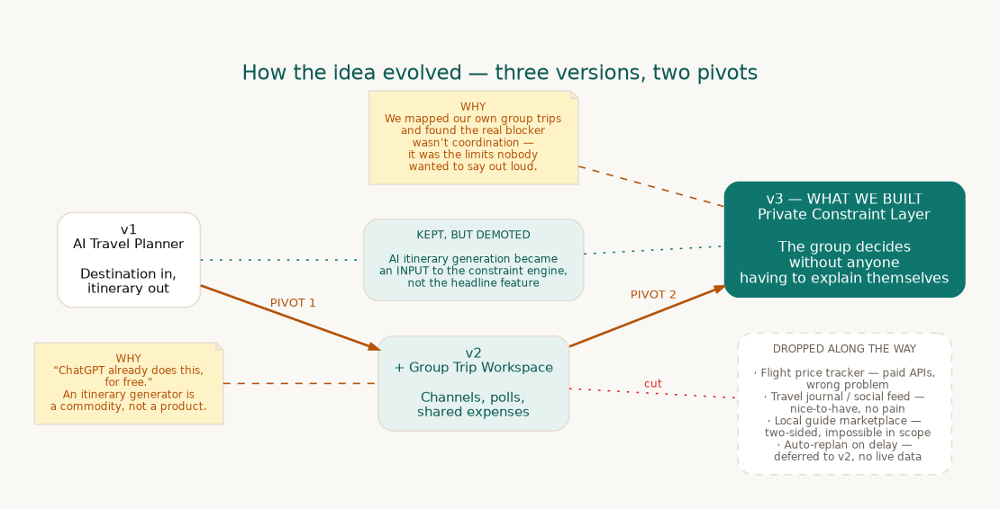

### **2.2 Ideation Boards**

**Board 1 — Problem tree.** We kept asking what sits *underneath* the surface complaint. Three of the four "decisions stall" branches turned out to point at the same root, and that root is not a logistics problem.

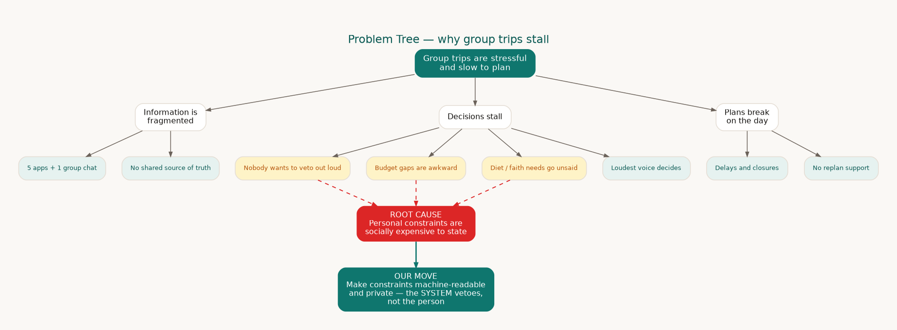

**Board 2 — Solution mindmap.** How the product decomposes from one core insight into four pillars. Note that Discovery reuses the same preference schema as the Private Constraint Layer — that reuse is why the fourth pillar is affordable for us at all.

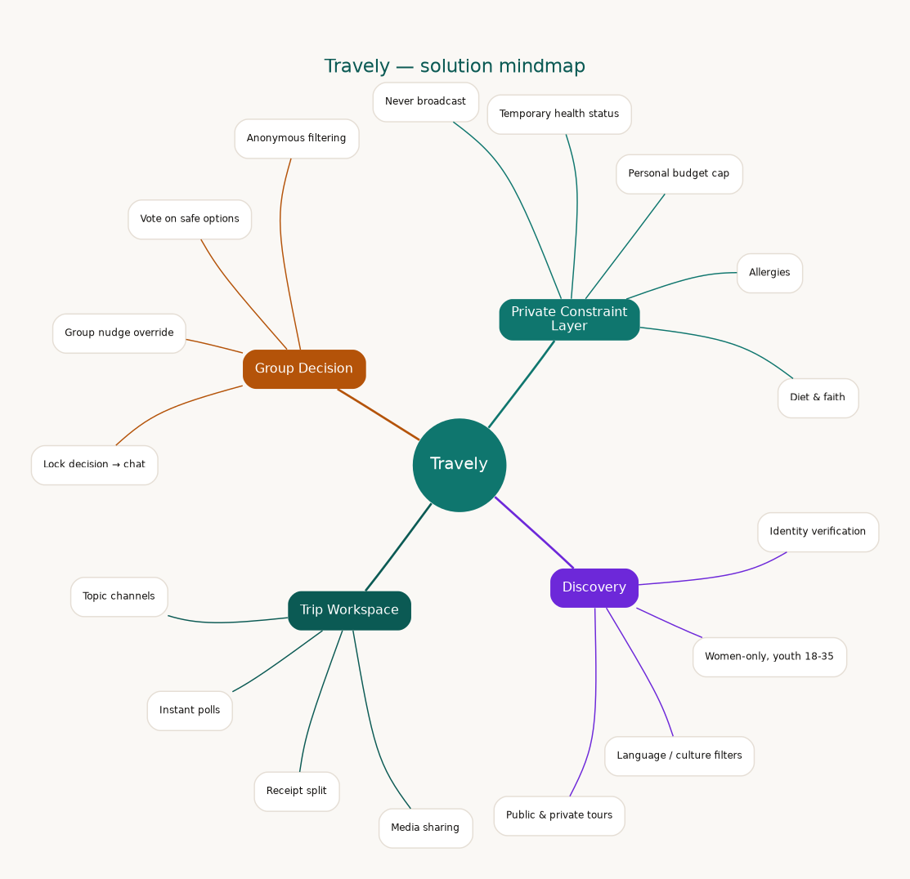

**Board 3 — 5 Whys.** The chain that produced our core feature.

1. Why do group trips take so long to plan? → Because the group can't converge on choices.
2. Why can't they converge? → Because half the group replies "anything also can."
3. Why do they say "anything also can"? → Because stating a real limit costs them socially.
4. Why is it socially expensive? → Because the limit exposes something private: income, faith, a medical condition.
5. Why does it have to be exposed at all? → **It doesn't. The app can hold the constraint and only publish the result.** ← this is Travely.

**Board 4 — Core user flow.** The moment the product earns its keep. The boundary between the two shaded regions is the whole product: private inputs on the left, a group-visible result on the right, and nothing crossing it but a count.

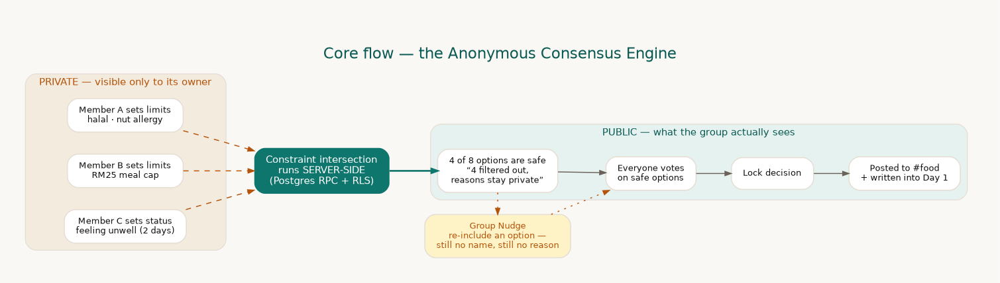

### **2.3 Mentor Consultation**

**Mentor: Janelle Tan — consulted 11 September 2026**

| Date | Mentor | Feedback Received | What Was Changed |
| :---- | :---- | :---- | :---- |
| 11 Sep 2026 | Janelle Tan | **On UI/UX:** the visual design and overall UX were assessed as solid, but she flagged that Global Tours was not user-friendly as built — a traveller could only scroll the list of open tours, with no way to look for a specific destination or a group that matched them. | Added a search bar to Global Tours, and paired it with filters for visibility, language, diet/faith, culture and gender group, so a solo traveller can go straight to the tours they could actually join instead of reading every card. This is also what let Discovery reuse the same preference schema as the private constraint layer rather than needing its own. |
| 11 Sep 2026 | Janelle Tan | **On the chatroom and the overall workflow:** rated the chatroom as the strongest part of the concept — not just as a place to talk, but because it manages the plan itself, which she noted matters most when a group rather than an individual is deciding. | We took this as a signal to push the idea further rather than just keep it. Channels moved from "nice to have" into must-ship scope, and we made **Lock Decision write the outcome into the itinerary day**, not only post it to `#food`. That closes the loop she identified: the chat is where the plan is managed, so a decision made there has to become the plan rather than sit in a message nobody scrolls back to. It is now the beat we demo on camera. |

---

## **3. Design & Prototype**

**UI Prototype:** https://travely.zichenangmarco.workers.dev/

**1 · Auth.** Email/Google sign-in. Deliberately minimal — the product's value starts at trip creation, so onboarding gets out of the way.

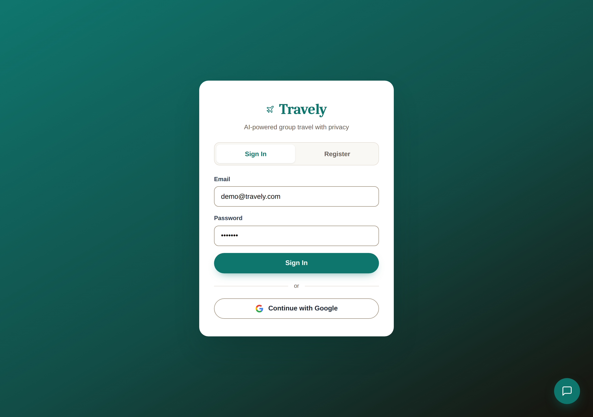

**2 · AI Planner.** Destination, travellers, dates, budget band and travel style. Five inputs, one screen, no wizard.

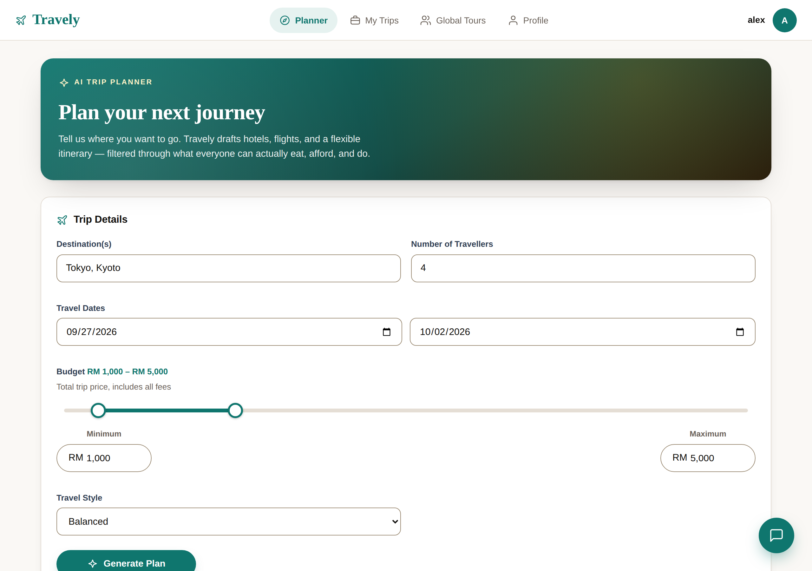

**3 · Plan results.** Generated hotels, flights and a suggested route. "Save as Trip" converts a draft into a collaborative workspace.

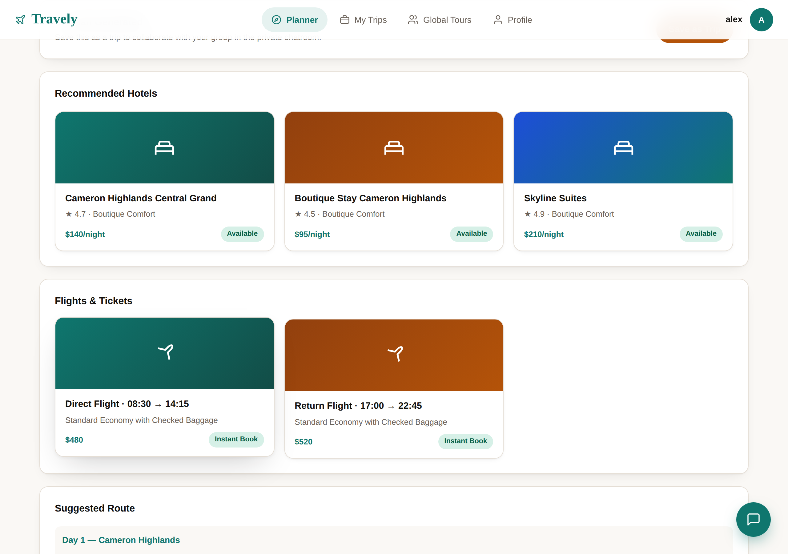

**4 · Profile → Private Limits.** ⭐ The heart of the product. Toggles for halal, vegetarian, nut allergy and no seafood, a private meal budget cap, and a temporary "feeling unwell" status. Every row's microcopy states that the setting is applied quietly and never broadcast.

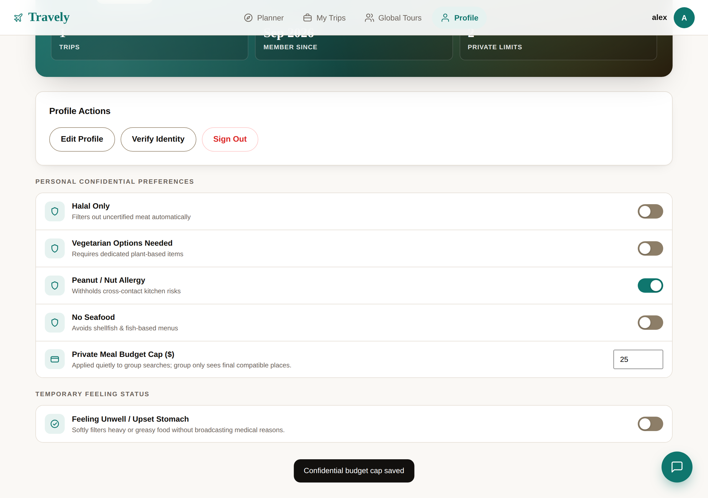

**5 · Decide tab.** ⭐ Eight restaurant options became four. The banner reports that four were filtered and that the reasons stay anonymous — no personal names, no raw budgets. Voting, the current leader and Lock Decision all live on this screen.

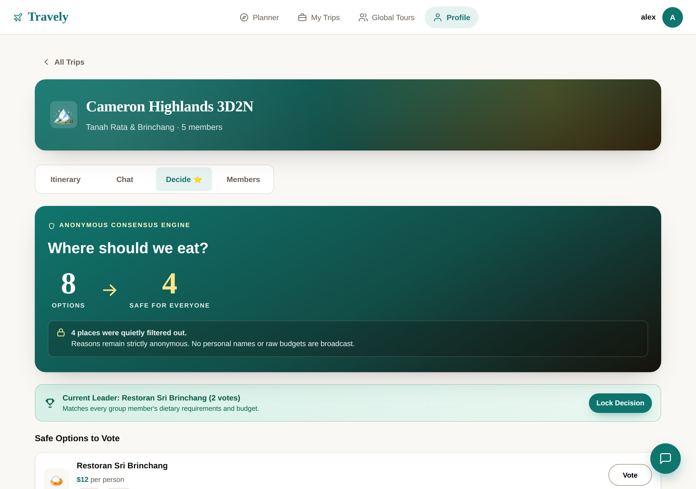

**6 · Filtered options & Group Nudge.** The group can open the filtered list and re-include any option with "Want anyway". Exclusions are labelled by category only and are never attributed to a member, so the override happens without anyone learning whose restriction caused it.

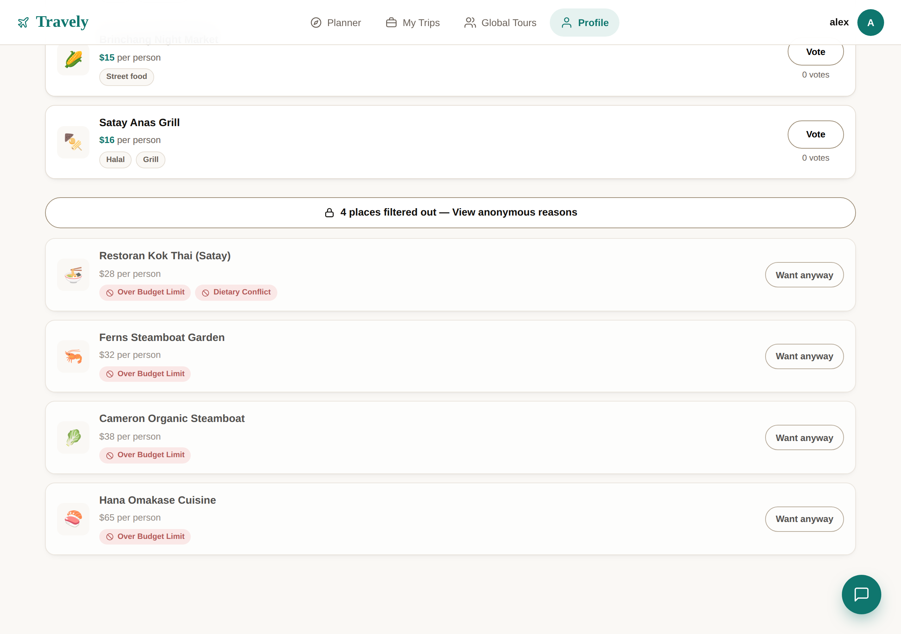

**7 · Trip chat + channels.** `#general` `#food` `#activities` `#transport` `#expenses` `#casual`, with the `+` menu: photo, video, instant poll, split receipt.

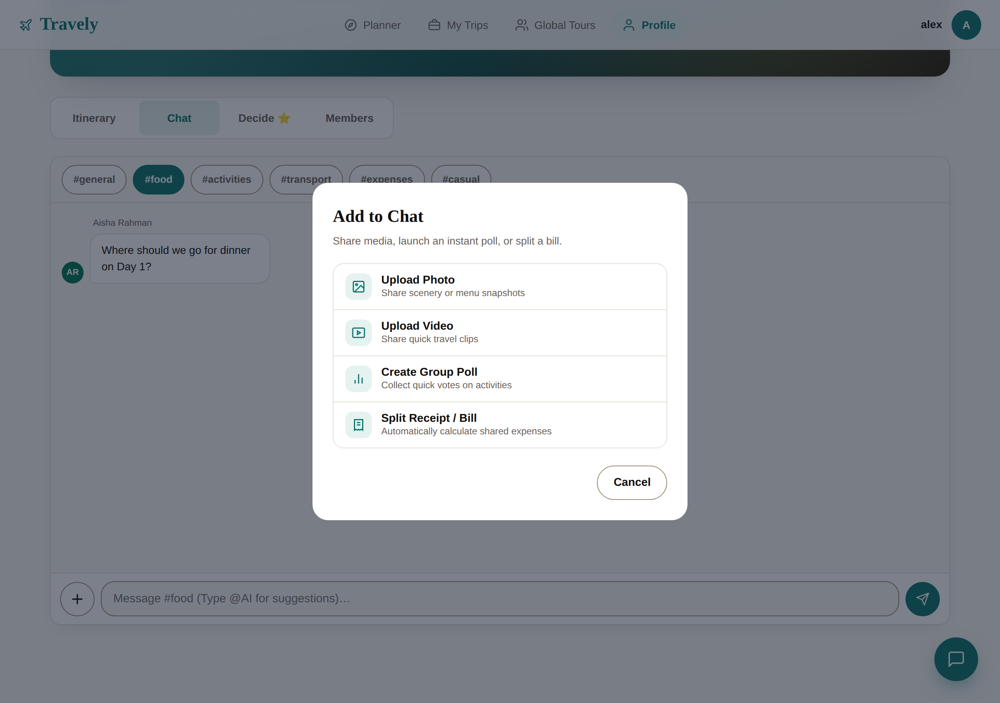

**8 · Receipt split.** A snapped bill posts into `#expenses` and the per-head share recalculates immediately across all five members.

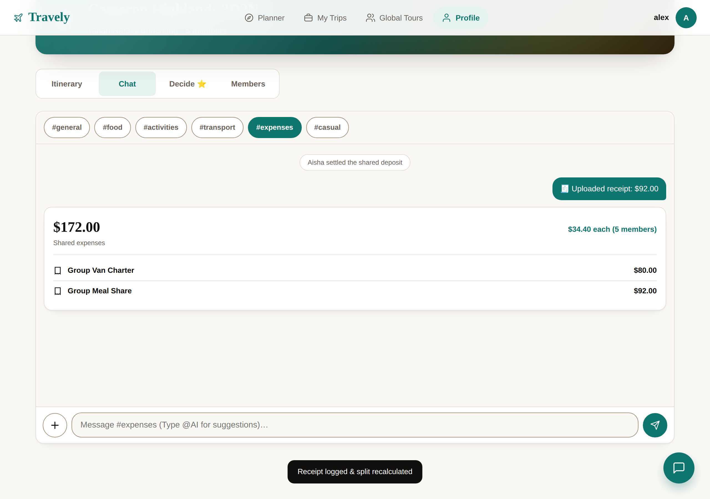

**9 · Itinerary.** Day-by-day plan; AI-matched entries are tagged "All Dietary Cleared" and can be reordered, removed or added to.

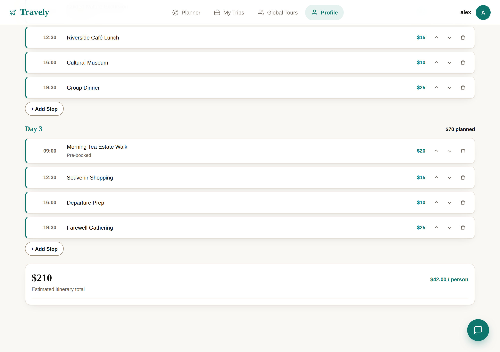

**10 · Global Tours.** Search plus filters for visibility, language, diet/faith, culture and gender group.

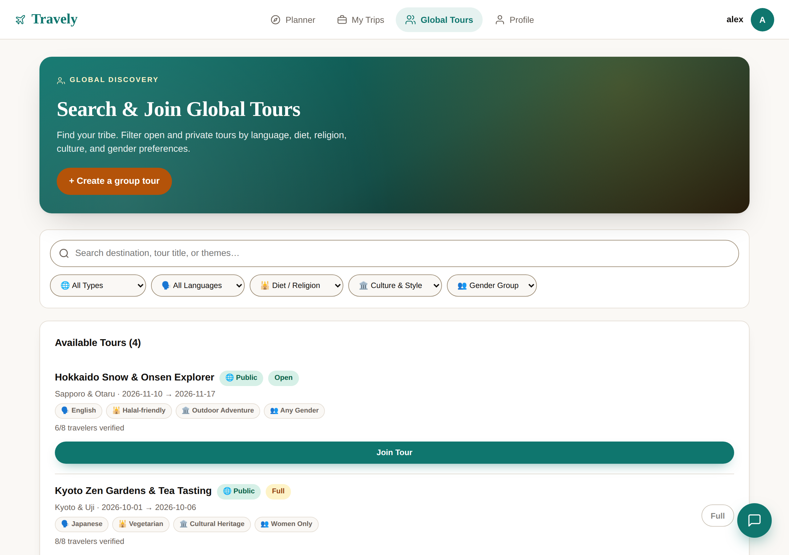

**11 · Identity verification.** Document type and number, then a face scan, before a user may join a group tour with strangers.

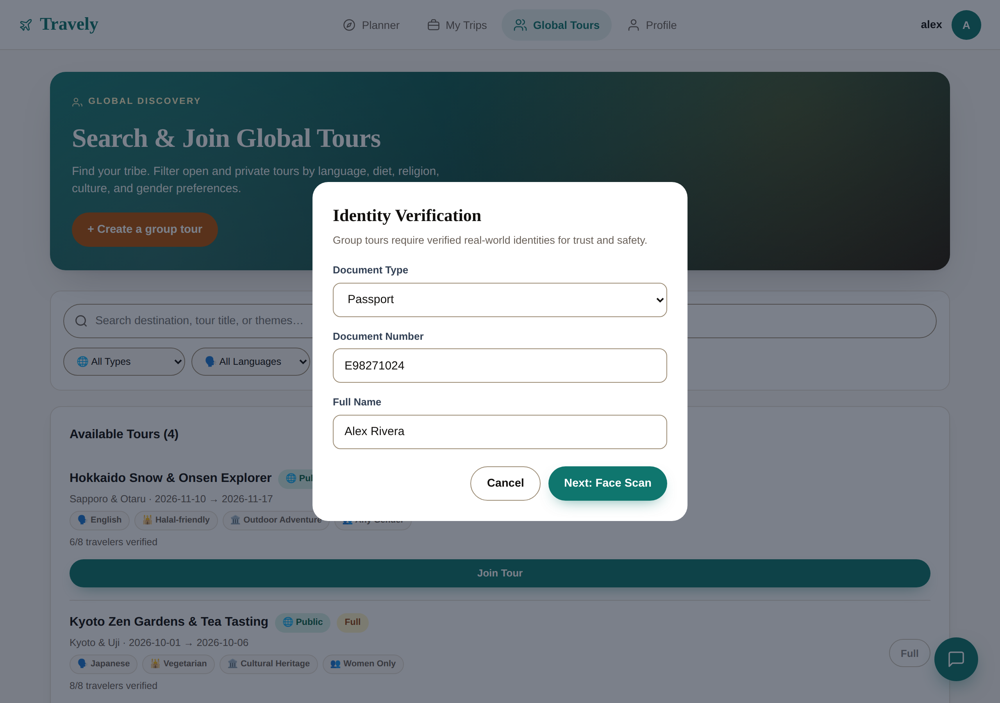

**Design system:** Inter for UI, Playfair Display for headings; deep teal primary (`#0F766E`) with amber accent on a warm off-white ground (`#FAF8F5`). Focus-visible outlines are implemented throughout and the layout is responsive to mobile viewports.

---

## **4. What Makes It Different**

**1. The Anonymous Consensus Engine (core novelty).**
Every other group-travel tool treats preferences as public metadata. We treat them as **confidential inputs to a shared computation.** The group receives the *intersection* — never the inputs. The output is framed as "4 places were quietly filtered out, reasons remain strictly anonymous," which lets the system carry the veto so no person has to. As far as we can find, no consumer travel app implements privacy-preserving group preference matching.

**2. The system vetoes, not the person.**
This is a social design decision, not a technical one. A student can set a RM25 meal cap and the group simply never sees the RM65 omakase as an option. Nobody learns who is broke, who is fasting, who is allergic, or who is unwell today.

**3. Temporary status.**
Constraints are not static. "Feeling unwell / upset stomach" quietly softens recommendations for 2 days and then expires — a health signal with no medical disclosure and no permanent record.

**4. Group Nudge.**
Privacy without deadlock. If the group really wants a filtered option, they can re-include it — but the override still doesn't reveal the source of the restriction. The person keeps the right to stay silent.

**5. Comfort-filtered verified tours.**
Global Tours reuses the same preference schema for discovery: halal-friendly, language-matched, women-only, youth 18–35 — with mandatory ID + face verification before joining strangers. Filters that other platforms treat as awkward are the exact reason a solo traveller trusts the group.

**6. Decision-to-itinerary closure.**
Lock Decision doesn't just end a vote; it posts the outcome to the right channel *and* writes it into the correct itinerary day. Most tools let you discuss or let you plan. We connect the two.

**Comparison:**

| Capability | Wanderlog | TripIt | Splitwise | Klook | WhatsApp + Sheets | **Travely** |
| :---- | :----: | :----: | :----: | :----: | :----: | :----: |
| Collaborative itinerary | ✅ | ⚠️ view-only | ❌ | ❌ | ⚠️ manual | ✅ |
| AI plan generation | ⚠️ basic | ❌ | ❌ | ❌ | ❌ | ✅ |
| **Private personal constraints** | ❌ | ❌ | ❌ | ❌ | ❌ | ✅ |
| **Anonymous group filtering** | ❌ | ❌ | ❌ | ❌ | ❌ | ✅ |
| Structured group decisions | ⚠️ comments | ❌ | ❌ | ❌ | ⚠️ chaos | ✅ |
| Expense splitting | ⚠️ basic | ❌ | ✅ | ❌ | ⚠️ manual | ✅ |
| Join verified stranger groups | ❌ | ❌ | ❌ | ⚠️ paid tours | ❌ | ✅ |
| Halal / faith-aware by default | ❌ | ❌ | ❌ | ⚠️ tags | ❌ | ✅ |

---

## **5. Technical Architecture & Feasibility**

Our team is comfortable across modern JS frameworks, so the stack below was chosen for fit rather than familiarity, React because the prototype ports cleanly, Supabase because it is the only free-tier option that lets us enforce our privacy claim in the database rather than in the UI.

### **Tech stack**

| Layer | Choice | Why | Constraint we expect |
| :---- | :---- | :---- | :---- |
| **Frontend** | **React.js + Vite + Tailwind**, shipped as a responsive PWA | Our prototype is already a working single-file HTML/CSS/JS app, so the design system and every interaction already exists — porting to components is mechanical, not exploratory. A PWA gives us "installable on a phone" without app-store review or two native codebases. | No native push on iOS PWAs; we use in-app notifications for the demo. |
| **Backend / DB** | Supabase (Postgres + Auth + Realtime + Storage) | One free tier covers auth, database, realtime chat and file storage. **Critically, Row-Level Security lets us enforce the privacy promise in the database rather than in the UI.** | Free tier pauses after inactivity — we keep it warm before judging. Realtime connection caps are far above demo needs. |
| **The constraint engine** | Postgres RPC (`get_safe_options(trip_id)`) + RLS policies | The intersection runs **server-side**. Raw member constraints are readable only by their owner; the client receives a filtered option list plus an integer count of exclusions. This is what makes "anonymous" an actual guarantee instead of a UI label. | Must be written carefully — a leaky RLS policy breaks the entire product promise. This is our highest-priority test. |
| **AI (LLM)** | **Qwen3.8-27B (open-weight) served via the Groq API**, called from a Supabase Edge Function | Groq's free tier needs no credit card and covers every model on the platform, and its inference is fast enough that itinerary generation feels instant on camera. An open-weight model also means we are not locked to one vendor's pricing later. Keys stay server-side; structured JSON output maps straight into itinerary objects. | Three real limits. **(1)** The free tier caps at ~30 requests/min and ~6,000 tokens/min — a full multi-day itinerary can approach that in one call, which is exactly why we generate once per trip and cache rather than regenerating per view, and why demo data is seeded in advance. **(2)** Qwen3.8-27B is currently listed by Groq as a *preview* model and may be withdrawn at short notice, so the Edge Function reads its model ID from a single constant with a stable fallback, and swapping it is a one-line change. **(3)** Open-weight models are less reliable at strict JSON than frontier models, so we validate the response server-side and retry once on a parse failure rather than passing malformed output to the client. |
| **Places / maps** | Google Places + Maps JS API (free monthly credit) | Real restaurants, real coordinates, real prices for the demo. | Billing account required even on free credit; we cap requests and cache results per destination. |
| **Flights / hotels** | Static seeded dataset for the demo | Real inventory APIs are paid or approval-gated. We show realistic data and are upfront that live booking is post-hackathon. | Honest scoping — we will state this in the video rather than fake a live booking. |
| **Identity verification** | **Mocked flow only** — the designed screens from the prototype, with no real document or biometric matching behind them | Real KYC is paid, regulated, and handles biometric data we have no lawful basis to process in a hackathon. Building a fake version that *looks* real would be worse than not building it. | We present it as a designed flow with a named integration path for production, and we say plainly in the video that it does not verify anything today. |
| **Hosting** | Vercel or Netlify (frontend) + Supabase cloud (backend) | Free, instant, HTTPS, preview URLs per commit. Meets the "must be deployable, not localhost" stipulation. | None material at our scale. |

**System architecture:**

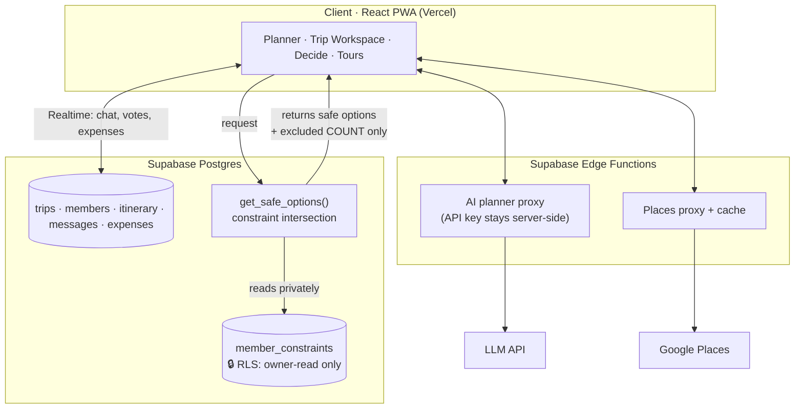
```mermaid
flowchart TB
    subgraph Client["Client · React PWA (Vercel)"]
        UI["Planner · Trip Workspace · Decide · Tours"]
    end
    subgraph Edge["Supabase Edge Functions"]
        AI["AI planner proxy<br/>(API key stays server-side)"]
        PL["Places proxy + cache"]
    end
    subgraph DB["Supabase Postgres"]
        T[("trips · members · itinerary · messages · expenses")]
        PR[("member_constraints<br/>🔒 RLS: owner-read only")]
        FN["get_safe_options()<br/>constraint intersection"]
    end
    UI <--> AI
    UI <--> PL
    UI <-->|"Realtime: chat, votes, expenses"| T
    UI -->|"request"| FN
    FN -->|"reads privately"| PR
    FN -->|"returns safe options<br/>+ excluded COUNT only"| UI
    AI --> LLM["LLM API"]
    PL --> GM["Google Places"]
```

### **Build plan & scope**

We are deliberately narrowing. Our judgement is that **one privacy guarantee that actually holds up is worth more than eight half-features**, so the Decide flow is the only thing we refuse to compromise on.

**In scope for the build phase (must ship):**

1. Auth + trip creation + invite to trip (Supabase Auth).
2. Private constraints stored per member under RLS — diet, allergy, budget cap, temporary status.
3. **`get_safe_options()` server-side intersection returning safe options + excluded count only.** ← the demo-critical path
4. Decide tab: vote, current leader, Lock Decision → posts to channel + writes to itinerary day.
5. Group Nudge re-inclusion.
6. Trip chat with channels + realtime, plus instant polls.
7. AI itinerary generation for one seeded destination, constraint-aware.
8. Itinerary view with add / reorder / remove.

**Stretch (only attempted on day 9, and only if 1–8 are stable and leak-tested):**

9. Receipt split with manual amount entry (OCR only if time genuinely allows).
10. Global Tours browse + filter, read-only.
11. Identity verification as a designed, non-functional flow.

With 10 days we expect to reach some of these, but they are sequenced last on purpose: none of them is what the product is for, and every one of them is a place where a team can lose three days polishing something a judge won't remember.

**Explicitly out of scope, and we will say so on camera:**

- Live flight/hotel booking and payments.
- Real KYC / biometric matching.
- Auto-replan on flight delay (v2 — architecture leaves room for it).
- Native iOS/Android builds.
- Multi-currency, offline mode, push notifications.

### **Resource & time awareness**

**Role allocation.** Four members, four build areas of comparable weight, and every person owns one non-build responsibility as well so the load is even:

| Member | Primary build area | Also owns |
| :---- | :---- | :---- |
| **Ang Zi Chen** | **Frontend core** — React app shell, routing, planner form, itinerary view, porting the prototype's design system into components | Deployment pipeline (Vercel), keeping the live link working at all times |
| **Chong Wen Kai** | **Backend & the constraint engine** — Supabase schema, Auth, RLS policies, `get_safe_options()` RPC | Writing the privacy leak test (sign in as Member B, assert Member A's constraints are unreachable) |
| **Len Chun Hoe** | **Realtime & AI** — trip chat channels, polls, expense splitting, the AI edge function | **Second reviewer on the RLS policies.** The privacy guarantee is the whole product, so it does not ship on one person's eyes |
| **Ng Yit Kai** | **Design & the Decide flow** — voting UI, filter banner, Group Nudge, Lock Decision handoff, plus the UX refinements from mentor feedback | Pitch, video and this document |

| Area | Our assessment |
| :---- | :---- |
| **Time** | **10 days.** Phase 1 (days 1–2): Supabase schema, auth, RLS policies, trip creation. Phase 2 (days 3–5): the constraint engine — `get_safe_options()` plus the full Decide flow, working end to end, reviewed and leak-tested. Phase 3 (days 6–8): chat channels, realtime, polls, AI itinerary generation, itinerary editor. Phase 4 (day 9): stretch items only if everything above is stable. Day 10: **feature freeze**, seed demo data, rehearse, record. Nothing new gets merged in the final 24 hours. |
| **Cost** | RM0 for the hackathon. Supabase free tier, Vercel hobby, Groq free tier for inference, Google Maps free monthly credit. Because we chose an open-weight model, our post-hackathon inference cost stays in the region of RM0.01–0.05 per generated itinerary even on paid tiers — and the itinerary is generated once per trip and cached rather than on every view. |
| **Biggest risk** | A privacy leak in our own RLS policies would be fatal to the pitch, not just to the code. Mitigation: one dedicated test that signs in as Member B and asserts that Member A's raw constraints are unreachable through every endpoint. We will demo this test on camera. |
| **Second risk** | Scope creep from Global Tours and verification, which are visually impressive but not the core. They are stretch items and will be cut without hesitation. |

### **Reach & scalability**

- **Beachhead:** university friend groups in Malaysia — multi-faith, multi-diet, budget-sensitive, travelling 2–4 times a year. If the constraint engine works for a Malaysian group table, it works almost anywhere.
- **Natural growth loop:** planning a trip requires inviting your group, so every trip created pulls in 3–7 new users. Global Tours then converts those users into hosts, reaching people outside any existing friend group.
- **Beyond travel:** the constraint engine is not travel-specific. The same private-intersection primitive settles team lunches, family gatherings, club events and corporate offsites — any group that has to choose one option under constraints people don't want to announce.

---

*Team High5 — Ang Zi Chen · Chong Wen Kai · Len Chun Hoe · Ng Yit Kai*  
*Lifestyle Track: Planning an Escape.*
